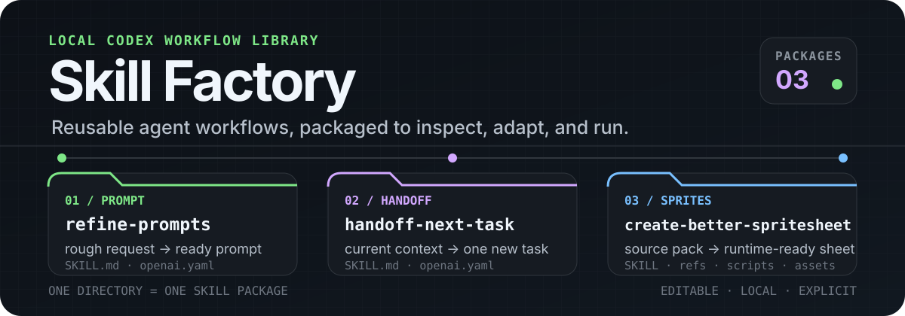

<p align="center">
  
</p>

<p align="center">
  <strong>Focused Codex skills with inspectable instructions, metadata, references, and tools.</strong><br>
  Pick one package, link it into your local skills directory, and invoke it by name.
</p>

## Start with a skill

Each top-level directory is an independent package. The package boundary keeps instructions, interface metadata, references, scripts, and assets together so a workflow can be reviewed or adapted without treating it as a black box.

| Skill                                                       | Use it when you need to…                                                                                | Invoke                       |
| ----------------------------------------------------------- | ------------------------------------------------------------------------------------------------------- | ---------------------------- |
| [`refine-prompts`](./refine-prompts/)                       | Turn a rough request into one copy-ready prompt without executing the underlying task                   | `$refine-prompts`            |
| [`handoff-next-task`](./handoff-next-task/)                 | Compress verified context into exactly one actionable, non-review Codex task and confirm that it starts | `$handoff-next-task`         |
| [`create-better-spritesheet`](./create-better-spritesheet/) | Design, assemble, validate, or integrate a contract-matched 2D character spritesheet                    | `$create-better-spritesheet` |

## Quick start

**Ask your Agent to install it.**

```text
Install these skills: https://github.com/ThreeArisesAll/skill-factory
```

Then invoke the installed skill explicitly:

```text
Use $refine-prompts to turn this rough request into one ready-to-use prompt: …
```

```text
Use $handoff-next-task to package the current work and start one concrete next task.
```

```text
Use $create-better-spritesheet to create a contract-matched walk cycle from these references: …
```

## Package anatomy

```text
<skill-name>/
├── SKILL.md              # Invocation contract and workflow
├── agents/
│   └── openai.yaml       # User-facing name, description, and default prompt
├── references/           # Optional branch-specific guidance
├── scripts/              # Optional deterministic tools
└── assets/               # Optional source or reference material
```

## License

This repository and its skill packages are available under the [MIT License](./LICENSE).
